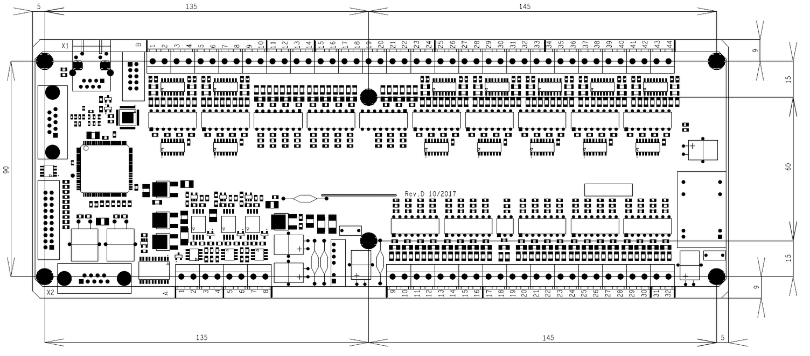

Инструкция по установке ЧПУ Plasmatic Precision Layout
------------------------------------------------------

Технические характеристики
^^^^^^^^^^^^^^^^^^^^^^^^^^

В таблице 1 приведены требования к управляющей ЭВМ. 

В качестве ЭВМ могут использоваться практически любые бюджетные ПК, включая ноутбуки.

.. list-table:: Таблица 1
   :widths: auto
   :header-rows: 1

   * - Характеристика
     - Описание
   * - Процессор
     - Intel Celeron или более производительный. Число ядер не менее двух.
   * - Операционная система 
     - Windows 7/10 или старше. Среда исполнения .NET 4.7.
   * - Экран
     - Диагональ не менее 15'', соотношение сторон любое. Возможна поддержка сенсорных панелей.

В таблице 2 приведены технические характеристики ЧПУ Plasmatic

.. list-table:: Таблица 2
   :widths: auto
   :header-rows: 1

   * - Характеристика
     - Описание
   * - Поддерживаемые оси.
     - Четыре оси: X - 2, Y - 1, Z - 1. Ось Z работает только в ручном режиме и совместно с системами IHS и THC.
   * - Точность позицинирования и скорость движения.
     - Точность позиционирования настраивается в диапазоне от 0.1 до 0.005 мм (по умолчанию - 0.05 мм). Максимальная частота выдачи импульсов на привода - 30 кГц.
   * - Интерфейс управления приводами.
     - CW/CCW или STEP/DIR (указывается при заказе).
   * - Питание.
     - Напряжение питания 24 В при токе 200 мА.
   * - Дискретные выходы.
     - Напряжение 24 В при токе до 50 мА.
   * - Дискретные входы.
     - Напряжение 24 В при токе до 16 мА.
   * - Аналоговые входы.
     - Усилие привода Z и датчик высоты газовой резки - 0..+10 В. Датчик напряжения плазменной дуги - 0..-10 В. Входное сопротивление аналоговых входов 47 кОм.
   * - Рабочая температура.
     - От -10 С до 40 С.
   * - Влажность.
     - 50% относительной влажности при 40 C, 90% относительной влажности при 20 C без выпадения коденсата.

Состав поставки
^^^^^^^^^^^^^^^

При получении системы ЧПУ Plasmatic Precision Layout следует:

1. Убедиться в получении всех заказанных компонентов системы. При отсутствии каких-либо позиций нужно обратиться к поставщику.

* Контроллер реального времени Plasmatic Precision Layout.
* Руководство оператора Plasmatic Precision Layout Operator Manual.
* Инструкция по установке и обслуживанию Plasmatic Precision Layout Service Manual (данный документ).

2. Проверить все компоненты системы на предмет наличия физических повреждений, которые могли быть причинены в ходе транспортировки. При наличии признаков повреждений обратитесь в Plasmatic. В любых сообщениях по поводу претензий должны указываться номер модели и серийный номер, расположенные на обратной стороне ЧПУ.

NB!: Все работы по установке и обслуживанию электрических систем должны выполняться только квалифицированными сотрудниками. Все технические вопросы следует направлять в службу технической поддержки Plasmatic. 

Установка контроллера Plasmatic
^^^^^^^^^^^^^^^^^^^^^^^^^^^^^^^

До выполнения электрических соединений сначала следует правильно разместить все компоненты системы. 

.. warning:: 
   Необходимо обеспечить заземление всех компонентов системы и металлизацию конструктивных элементов!

Монтаж платы контроллера Plasmatic осуществляется на стойки М3 длиной от 5 мм.

Подключение контроллера Plasmatic
^^^^^^^^^^^^^^^^^^^^^^^^^^^^^^^^^

Подключение контроллера Plasmatic к портальной машине осуществляется посредством клеммных колодок и соединителей, расположенных на периферии платы.

Подключение контроллера Plasmatic к управляющей ЭВМ осуществляется через стандартный разъём X1 типа RJ-45 (Ethernet).

Дискретные входы и выходы имеют световую индикацию на плате контроллера. Для всех входов контроллера, ответственных за контроль состояния системы 
(концевые включатели, готовность приводов и др.), принята логика, при которой нормальному состоянию входа соответствует поданный сигнал и на плате 
горит соответствующий светодиод.

Клеммные колодки расположены по двум сторонам - A и B, нумерация клемм приведена на плате.

Наже приведено назначение клеммных колодок и описание сигналов.

.. list-table:: Назначение клеммных колодок
   :widths: auto
   :header-rows: 1

   * - Номер клеммы
     - Описание
   * - Выходы приводов
     - 
   * - B1
     - Питание приводов +24 В (к источнику питания)
   * - B2
     - Общий приводов 0 В (к источнику  питания)
   * - B3
     - Движение правого привода оси -X
   * - B4
     - Движение правого привода оси +X
   * - B5
     - Движение левого привода оси -X
   * - B6
     - Движение левого привода оси +X
   * - B7
     - Движение привода оси -Z
   * - B8
     - Движение привода оси +Z
   * - B9
     - Движение привода оси -Y
   * - B10
     - Движение привода оси +Y
   * - Входы приводов
     - 
   * - B11
     - Готовность правого привода X
   * - B12
     - Готовность левого привода X
   * - B13
     - Готовность привода Y
   * - B14
     - Готовность привода Z
   * - Входы процесса
     - 
   * - B15
     - Питание входов и выходов процесса +24 В (к источнику питания)
   * - B16
     - Общий 0 В входов и выходов процесса (к источнику  питания)
   * - B17
     - Датчик касания листа роллером (срабатывания размыкателя суппорта)
   * - B18
     - Датчик касания листа плазмотроном
   * - B19
     - Датчик горения дуги
   * - B20
     - Выключение контроля высоты
   * - B21
     - Общий 0 В входов и выходов процесса
   * - B22
     - Датчик столкновения резака
   * - B23
     - Датчик распознавания газового резака
   * - B24
     - Кнопка аварийной остановки
   * - Выходы процесса
     - 
   * - B25
     - Реле включения источника плазмы
   * - B26
     - Реле включения поиска листа
   * - B27
     - Включение разогрева металла (для газовой резки)
   * - B28
     - Включение осциллятора (для газовой резки)
   * - B29
     - Включение поджигающего газа (для газовой резки)
   * - B30
     - Включение режущего кислорода (для газовой резки)
   * - B31
     - Включение лазерного указателя
   * - B32
     - Световая индикация работы
   * - B33
     - Резерв
   * - B34
     - Клапан управления заслонкой H
   * - B35
     - Клапан управления заслонками F
   * - B36
     - Клапан управления заслонками G
   * - B37
     - Клапан управления заслонками H
   * - B38
     - Клапан управления заслонками I
   * - B39
     - Клапан управления заслонками J
   * - B40
     - Клапан управления заслонками K
   * - B41
     - Клапан управления заслонками A
   * - B42
     - Клапан управления заслонками B
   * - B43
     - Клапан управления заслонками C
   * - B44
     - Клапан управления заслонками D
   * - Аналоговые входы
     -
   * - A1
     - Общий датчика усилия 0 В (к источнику  питания)
   * - A2
     - Питание +24 В датчика усилия (к источнику питания)
   * - A3
     - Общий датчика усилия 0 В
   * - A4
     - Датчик усилия (0..10 В)
   * - A5
     - Общий датчиков высоты 0 В
   * - A6
     - Датчик высоты плазменного резака (-10..0 В)
   * - A7
     - Общий датчиков высоты 0 В
   * - A8
     - Датчик высоты газового резака (0..10 В)
   * - Входы концевых выключателей
     -
   * - A9
     - Выключатель левого привода +X
   * - A10
     - Выключатель левого привода -X
   * - A11
     - Выключатель правого привода +X
   * - A12
     - Выключатель правого привода -X
   * - A13
     - Выключатель привода +Y
   * - A14
     - Выключатель привода -Y
   * - A15
     - Выключатель привода +Z
   * - A16
     - Выключатель привода -Z
   * - Входы панели управления
     - 
   * - A17
     - Общий питания контроллера 0 В
   * - A18
     - Кнопка Движение +X
   * - A19
     - Кнопка Движение -X
   * - A20
     - Кнопка Движение +Y
   * - A21
     - Кнопка Движение -Y
   * - A22
     - Кнопка Движение +Z
   * - A23
     - Кнопка Движение -Z
   * - A24
     - Кнопка Пуск
   * - A25
     - Кнопка Стоп
   * - A26
     - Кнопка Движение назад по контуру
   * - A27
     - Кнопка Движение вперёд по контуру
   * - A28
     - Кнопка Переход
   * - A29
     - Вход квадратурного энкодера Увеличение скорости
   * - A30
     - Выход квадратурного энкодера Уменьшение скорости
   * - Питание
     - 
   * - A31
     - Общий питания контроллера 0 В (к источнику питания)
   * - A32
     - Питание контроллера +24 В (к источнику питания)

Электромагнитная совместимость
^^^^^^^^^^^^^^^^^^^^^^^^^^^^^^

При разработке системы ЧПУ Plasmatic Precision Layout особое внимание уделялось проблемам устойчивости контроллера и канала связи с ЭВМ к помехам, 
вызванным как собственно сложной помеховой обстановкой на производствах, так и ВЧ помехами, создаваемыми плазменной дугой, особенно при работе осциллятора. 
Опыт Plasmatic в разработке систем ЧПУ, а также инверторных и тиристорных источников тока для плазменной резки мощностью до 150 кВА, показывает: 
особую опасность представляют помехи, носящие кондуктивный характер и распространяющие по цепям питания и сигнальным цепям.

В системе ЧПУ Plasmatic Precision Layout парирование помех на программном уровне осуществляется посредством реализованного информационного обмена между 
контроллером реального времени и ЭВМ по протоколу TCP/IP, осуществляющему контроль доставки и целостности посылок. Поверх транспортного протокола TCP/IP 
реализована система контроля целостности посылок методом Cyclic Redundancy Check (CRC).

Контроллер имеет встроенный асинхронный буфер комманд типа FIFO, позволяющий компенсировать задержки по сети Ethernet.

Аппаратные меры, принятие в контроллере Plasmatic:

* Плата контроллера выполнена на четырехслойном стеклотекстолите с разделением земляных полигонов.
* Все входы и выходы контроллера, включая аналоговые, имеют оптическую гальваническую развязку с процессором.
* Интерфейс Ethernet имеет гальваническую изоляцию, выполненную посредством импульсного трансформатора и RC-цепей, обеспечивающих подавление 
синфазной и дифференциальной составляющих наводки в канале связи.
* Для системы стабилизатора высоты резака Plasmatic рекомендует использовать гальванически изолированный датчик напряжения дуги.

Лицензия
^^^^^^^^

ПО Plasmatic Precision Layout защищено от несанкционированного копирования файлом лицензии, находящимся в папке с программой.

Для получения лицензии на систему ЧПУ выполните следующие действия.

* Во время первого запуска система предложит сгенерировать *.psk-файл. Сохраните его на диск под лююбым именем и пришлите в Plasmatic.
* Полученный в ответ файл с лицензией поместите в папку с ПО.

.. NOTE:: 
   В случае замены основных частей компьютера в т.ч. процессора, жёсткого диска или материнской платы, потребуется бесплатное обновление файла лицензии.

 

Принципиальная электрическая схема
^^^^^^^^^^^^^^^^^^^^^^^^^^^^^^^^^^

Принципиальная электрическая схема контроллера реального времени Plasmatic поможет ускорить процесс освоения системы.

:download:`Принципиальная электрическая схема контроллера Plasmatic <art/plasmatic_cnc_revd.pdf>`