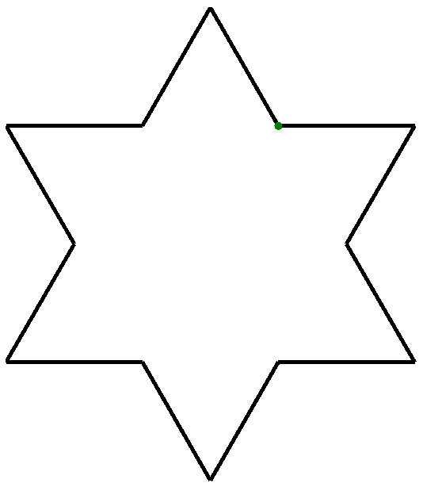
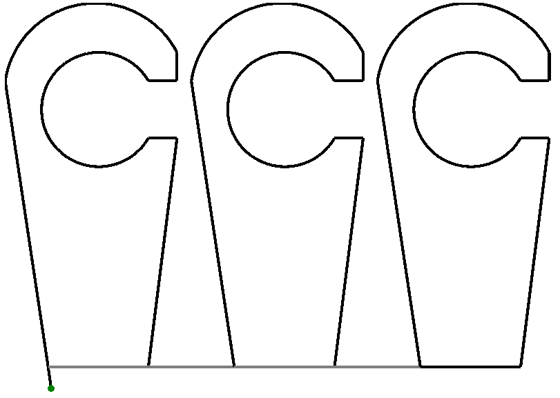
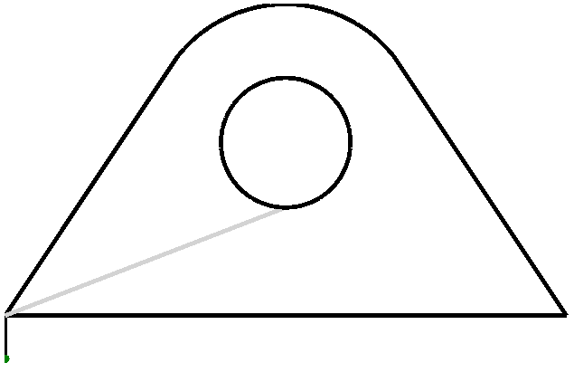

Инструкция по программированию
===================================

Инструкция по программированию является основным документом, описывающим
порядок составления управляющих программ на языках ESSI и G-Code в
системе Plasmatic Precision Layout.

В руководстве дано описание кадров перемещения, технологических кадров,
синтаксис определения и вызова подпрограмм, приведены примеры.

Предварительные замечания
---------------------------

Для программ на языке ESSI значения скоростей движения, времени
ускорения, времени пробивки и величины поправки на ширину реза задаются
в настройках программы Plasmatic Precision Layout и не рассматриваются в
данном руководстве.

Для программ на языке G-Code есть возможность установки основной рабочей
скорости непосредственно в коде программы, или переопределения этой
скорости в настройках чертежа в программе Plasmatic Precision Layout.

1. .. rubric:: Язык G-code
      :name: язык-g-code

2. .. rubric:: Основные положения
      :name: основные-положения

При использовании языка G-code:

-  все значения перемещений указываются в миллиметрах, например:

   -  G01 X12.50 Y0 переместит резак на 12.5 миллиметра.

-  Значения задержек указываются в секундах, например:

   -  G04 X2.5 – задержка на 2.5 секунды.

-  Значения скоростей указываются в мм/мин, например:

   -  G01 X100 Н50.25 F3000 – Перемещение и установка рабочей скорости
      3000 мм/мин.

Для версии ЧПУ с поддержкой точности позиционирования 0,1 мм значения
сотых долей не теряется, используются специальные алгоритмы компенсации
погрешности.

Поддерживаемые команды
----------------------

+------------------------------------------------+----------------------------------------------------------------------------------------------------------------------------------------------------------------+
| **Пример**                                     | **Описание**                                                                                                                                                   |
+================================================+================================================================================================================================================================+
| **G00 X100 Y100**                              | Ускоренное перемещение инструмента (холостой ход)                                                                                                              |
|                                                |                                                                                                                                                                |
|                                                | **X, Y** – Смещение конечной точки относительно начала в мм                                                                                                    |
+------------------------------------------------+----------------------------------------------------------------------------------------------------------------------------------------------------------------+
| **G01 X23.28 Y28.94 F1000**                    | Ускоренное перемещение инструмента (холостой ход). Необязательный параметр F может использоваться для установки рабочей скорости.                              |
|                                                |                                                                                                                                                                |
|                                                | **X, Y** – Смещение конечной точки относительно начала в мм                                                                                                    |
|                                                |                                                                                                                                                                |
|                                                | **F** – рабочая скорость (мм/мин) (необязательный параметр)                                                                                                    |
+------------------------------------------------+----------------------------------------------------------------------------------------------------------------------------------------------------------------+
| **G02 G03 X-7.07 Y0.21 I-3.53 J-3.54 F4000**   | Круговая интерполяция по часовой стрелке.                                                                                                                      |
|                                                |                                                                                                                                                                |
|                                                | **X, Y** – Смещение конечной точки относительно начала в мм                                                                                                    |
|                                                |                                                                                                                                                                |
|                                                | **I, J** – Смещение центра окружности относительно начала в мм                                                                                                 |
|                                                |                                                                                                                                                                |
|                                                | **F** – рабочая скорость (мм/мин) (необязательный параметр)                                                                                                    |
+------------------------------------------------+----------------------------------------------------------------------------------------------------------------------------------------------------------------+
| **G03 X-141.42 I-70.71 J70.71 F4000**          | Круговая интерполяция против часовой стрелки.                                                                                                                  |
|                                                |                                                                                                                                                                |
|                                                | **X, Y** – Смещение конечной точки относительно начала в мм                                                                                                    |
|                                                |                                                                                                                                                                |
|                                                | **I, J** – Смещение центра окружности относительно начала в мм                                                                                                 |
|                                                |                                                                                                                                                                |
|                                                | **F** – рабочая скорость (мм/мин) (необязательный параметр)                                                                                                    |
+------------------------------------------------+----------------------------------------------------------------------------------------------------------------------------------------------------------------+
| **G04 X0.05**                                  | Программируемая задержка.                                                                                                                                      |
|                                                |                                                                                                                                                                |
|                                                | **X** – Значение задержки в мс                                                                                                                                 |
+------------------------------------------------+----------------------------------------------------------------------------------------------------------------------------------------------------------------+
| **G21**                                        | Режим работы в метрической системе                                                                                                                             |
+------------------------------------------------+----------------------------------------------------------------------------------------------------------------------------------------------------------------+
| **G40**                                        | Отмена компенсации ширины реза                                                                                                                                 |
+------------------------------------------------+----------------------------------------------------------------------------------------------------------------------------------------------------------------+
| **G41**                                        | Компенсировать ширину реза слева от траектории                                                                                                                 |
+------------------------------------------------+----------------------------------------------------------------------------------------------------------------------------------------------------------------+
| **G42**                                        | Компенсировать ширину реза справа от траектории                                                                                                                |
+------------------------------------------------+----------------------------------------------------------------------------------------------------------------------------------------------------------------+
| **G43 X0.20**                                  | Задание поправки на ширину реза, в миллиметрах                                                                                                                 |
|                                                |                                                                                                                                                                |
|                                                | **X** – Значение поправки в мм                                                                                                                                 |
+------------------------------------------------+----------------------------------------------------------------------------------------------------------------------------------------------------------------+
| **G91**                                        | Задание координат относительно последней точки                                                                                                                 |
+------------------------------------------------+----------------------------------------------------------------------------------------------------------------------------------------------------------------+
| **M00**                                        | Программируемый останов. Работа останавливается, система переходит в ручной режим (режим паузы). Данный кадр используется для планового обслуживания резака.   |
+------------------------------------------------+----------------------------------------------------------------------------------------------------------------------------------------------------------------+
| **M07**                                        | Включение резака (с использованием настроенной циклограммы включения)                                                                                          |
+------------------------------------------------+----------------------------------------------------------------------------------------------------------------------------------------------------------------+
| **M08**                                        | Выключение резака (с использованием настроенной циклограммы отключения)                                                                                        |
+------------------------------------------------+----------------------------------------------------------------------------------------------------------------------------------------------------------------+
| **M02**                                        | Конец программы                                                                                                                                                |
+------------------------------------------------+----------------------------------------------------------------------------------------------------------------------------------------------------------------+

1. .. rubric:: Язык ESSI
      :name: язык-essi

2. .. rubric:: Формат кадров перемещения
      :name: формат-кадров-перемещения

Кадр перемещения задает желаемую траекторию движения портала.

Задание перемещений в кадре осуществляется в приращениях относительно
конечной точки предыдущего кадра.

Приращения выражаются целыми числами, которым предшествует знак “+” или
“–“, обозначающий направление перемещения вдоль оси. Если приращение по
какой-либо из координат равно нулю, на соответствующем месте может
присутствовать только знак; опускать нулевое значение целиком, включая и
знак, запрещено.

Фактическое перемещение портала, соответствующее одной единице
приращения, задается в настройках и равно, по умолчанию, 0,1 мм. Так
величина 128 соответствует реальному перемещению .

Синтаксис кадров перемещения идентичен для прорезаемых отрезков и
отрезков холостого пробега, однако скорости движения могут быть разными,
в соответствии со значениями, указанными в настройках.

Линейный кадр
~~~~~~~~~~~~~

Линейный кадр задает участок движения по прямому отрезку.

*Синтаксис команды*

<±X> <±Y>

*Параметры*

<±X>: приращение перемещения вдоль оси X

<±Y>: приращение перемещения вдоль оси Y

*Примеры*

+------------+---------------------------------------------+
| +500+200   | Перемещение по оси Х на , по оси Y – на .   |
+============+=============================================+
| +100-215   | Перемещение по оси Х на , по оси Y – на .   |
+------------+---------------------------------------------+
| +-4612     | Перемещение по оси Y на                     |
+------------+---------------------------------------------+
| +840+      | Перемещение по оси X на                     |
+------------+---------------------------------------------+

Круговой кадр
~~~~~~~~~~~~~

Круговой кадр задает желаемую траекторию движения по окружности или
дуге.

Дуга задается относительным положением конечной точки, радиусом
окружности, параметром, определяющим выбор большой или малой дуги обхода
и направлением обхода. Необходимость двух последних параметров
определяется тем, что через две точки можно провести две окружности
одного радиуса, которым в сумме будет принадлежать четыре дуги.

*Синтаксис команды*

<±X> <±Y> <+R > <S> <D>

*Параметры*

<±X>: относительное приращение положения конечной точки вдоль оси X

<±Y>: относительное приращение положения конечной точки вдоль оси Y

<+R >: радиус окружности, проведенной через две точки.

<S>: выбор большой – “+” или малой – “-” дуги обхода

<D>: направление обхода против часовой стрелки – “-”, по часовой – “+”

*Примеры*

+1000+0+500++

-1000-1000+500++

Кадры определения и вызова подпрограмм
--------------------------------------

Подпрограммой называется выделенная последовательность кадров, которая
может многократно вызываться из программы. Подпрограммы могут быть
использованы для вырезки одинаковых деталей, элементов деталей, а также
для поворота и масштабирования.

Подпрограммы вызываются из основной программы наряду с обыкновенными
кадрами перемещения и технологическими кадрами.

Каждая подпрограмма, подобно технологическим функциям, имеет свой номер.
Номер подпрограммы представляет собой целое число в диапазоне от 101 до
30000. В программе не должно быть двух подпрограмм с одинаковыми
номерами

Подпрограммы описываются в начале основной программы. Описание состоит
из кадра начала подпрограммы, последовательности кадров, являющихся
телом подпрограммы, и кадра конца подпрограммы.

Тело подпрограммы состоит из кадров перемещения, технологических кадров
и вызова других подпрограмм. Определения подпрограмм не могут быть
вложенными, т.е. в теле одной подпрограммы не должно содержаться
определение другой. Однако вызовы подпрограмм могут быть вложенными
(одна подпрограмма может вызывать другую), но глубина вложения не должна
превышать пяти. Запрещена прямая и косвенная рекурсия.

Кадр начала подпрограммы
~~~~~~~~~~~~~~~~~~~~~~~~

Данный кадр дает имя подпрограмме. Последовательность кадров после него,
вплоть до кадра конца подпрограммы, является телом подпрограммы.

*Синтаксис*

<номер подпрограммы+>

*Пример*

101+

Кадр конца подпрограммы
~~~~~~~~~~~~~~~~~~~~~~~

Данный кадр замыкает последовательность кадров, являющихся телом
подпрограммы.

*Синтаксис*

<номер подпрограммы->

*Пример*

101-

Кадр вызова подпрограммы
~~~~~~~~~~~~~~~~~~~~~~~~

Кадр вызова подпрограммы выполняет последовательность кадров,
определенную в теле подпрограммы.

*Синтаксис команды*

<№> <+R> <±A > <+M>

*Параметры*

<№>: номер подпрограммы

<+R>: число повторений

<±A >: угол поворота в десятых долях градуса

<+M>: масштаб в процентах

*Примеры*

+-------------------+-------------------------------------------------------------+
| 101               | Вызов подпрограммы без параметров                           |
+===================+=============================================================+
| 102+1+450         | Поворот на 45˚ по часовой стрелке                           |
+-------------------+-------------------------------------------------------------+
| 2000+2++25        | Двукратное выполнение с уменьшением в четыре раза           |
+-------------------+-------------------------------------------------------------+
| 10000+1+900+200   | Поворот на 90˚ по часовой стрелке и увеличение в два раза   |
+-------------------+-------------------------------------------------------------+

Последовательность кадров, определенная в подпрограмме, может быть
выполнена многократно, в соответствии с заданным числом повторений.

Контур, определяемый телом подпрограммы, может быть повернут с
изменением масштаба. Угол поворота задается целым числом в десятых долях
градуса в диапазоне от -3600 до +3600. При этом положительное значение
означает поворот по часовой стрелке, отрицательное – против. Изменение
масштаба задается в десятых долях процента.

Три последних аргумента кадра вызова подпрограммы могут быть полностью
опущены вместе со знаками. При этом по умолчанию количество повторений
принимается равным единице, угол поворота – нулю, масштаб – 100%.

При вложенных вызовах подпрограмм указанные в них углы поворота
суммируются, масштабные коэффициенты – перемножаются.

Технологические кадры
---------------------

Технологические кадры используются для выполнения специальных функций.

Описание технологических кадров приведено в таблице 1.

Таблица 1

+---------+----------------------------------+------------------------------------------------------------------------------------------------------------------------------------------------------------------------------------------------+
| Номер   | Действие                         | Описание                                                                                                                                                                                       |
|         |                                  |                                                                                                                                                                                                |
| кадра   |                                  |                                                                                                                                                                                                |
+---------+----------------------------------+------------------------------------------------------------------------------------------------------------------------------------------------------------------------------------------------+
| 0       | Программируемый останов          | Портал останавливается, система переходит в ручной режим (режим паузы). Данный кадр используется для планового обслуживания резака.                                                            |
+---------+----------------------------------+------------------------------------------------------------------------------------------------------------------------------------------------------------------------------------------------+
| 29      | Прорез слева                     | Вводится поправка на ширину реза. Резак смещается влево от запрограммированного контура, если смотреть по направлению движения. Величина поправки составляет половину величины ширины реза.    |
+---------+----------------------------------+------------------------------------------------------------------------------------------------------------------------------------------------------------------------------------------------+
| 30      | Прорез справа                    | Вводится поправка на ширину реза. Резак смещается вправо от запрограммированного контура, если смотреть по направлению движения. Величина поправки составляет половину величины ширины реза.   |
+---------+----------------------------------+------------------------------------------------------------------------------------------------------------------------------------------------------------------------------------------------+
| 38      | Отмена поправки на ширину реза   | Заканчивается действие функций 29 и 30.                                                                                                                                                        |
+---------+----------------------------------+------------------------------------------------------------------------------------------------------------------------------------------------------------------------------------------------+
| 53      | Включение плазменного резака     | Производится зажигание плазмы и пробивка металла.                                                                                                                                              |
+---------+----------------------------------+------------------------------------------------------------------------------------------------------------------------------------------------------------------------------------------------+
| 54      | Выключение плазменного резака    | Плазма гасится.                                                                                                                                                                                |
+---------+----------------------------------+------------------------------------------------------------------------------------------------------------------------------------------------------------------------------------------------+

Примеры программ на ESSI
-------------------------
     

Звезда
~~~~~~~~

Рассматриваемый пример использует подпрограмму, состоящую из двух
кадров. Конечная фигура получается в результате шестикратного вызова
подпрограммы с поворотом на 60 градусов и масштабированием. Следует
отметить, что поворот производится каждый раз при вызове подпрограммы, а
масштабирование применяется ко всем вызовам подпрограммы один раз.

+-----------------+------------+
| 101+            | |image0|   |
|                 |            |
| +230+400        |            |
|                 |            |
| +230-400        |            |
|                 |            |
| 101-            |            |
|                 |            |
| 53              |            |
|                 |            |
| 101+6-600+150   |            |
|                 |            |
| 54              |            |
+-----------------+------------+

Крюк
~~~~

В основе данного примера лежит деталь, включающая в себя прямые, острые
и тупые углы, а также окружности. Деталь дублируется с применением
подпрограммы, в которую помимо кадров перемещения входят технологические
кадры выключения и выключения плазмы. Непосредственному началу резки
деталей предшествует отрезок, на котором происходит пробивка металла и
стабилизация режима резания.

+-------------------+------------+
| 1000+             | |image1|   |
|                   |            |
| 53                |            |
|                   |            |
| -300+2000         |            |
|                   |            |
| +1200+200+640-+   |            |
|                   |            |
| +-200             |            |
|                   |            |
| -200+             |            |
|                   |            |
| --400+400+-       |            |
|                   |            |
| +200+             |            |
|                   |            |
| -200-1600         |            |
|                   |            |
| -700+             |            |
|                   |            |
| 54                |            |
|                   |            |
| 1000-             |            |
|                   |            |
| 1000              |            |
|                   |            |
| +1300+            |            |
|                   |            |
| 1000              |            |
|                   |            |
| +1300+            |            |
|                   |            |
| 1000              |            |
+-------------------+------------+

Петля
~~~~~

Настоящий пример показывает способ программирования движения по
замкнутой окружности. Существует два способа задания окружности –
посредством двух полуокружностей, как в настоящем примере, и при помощи
одной дуги, образующей разорванное кольцо. Во втором случае, начало и
конец дуги находятся на близком расстоянии меньшем ширины реза. Таким
образом, дуга не может начинаться и заканчиваться в одной точке.

+----------------+------------+
| 53             | |image2|   |
|                |            |
| ++200          |            |
|                |            |
| +800+1200      |            |
|                |            |
| +1000++640-+   |            |
|                |            |
| +800-1200      |            |
|                |            |
| -2600+         |            |
|                |            |
| 54             |            |
|                |            |
| +1300+500      |            |
|                |            |
| 53             |            |
|                |            |
| ++600+300+-    |            |
|                |            |
| +-600+300+-    |            |
|                |            |
| 54             |            |
+----------------+------------+

