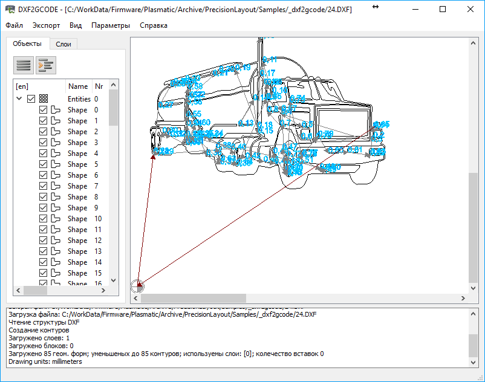
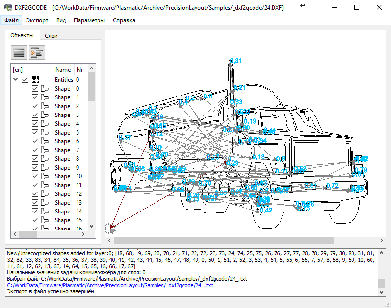
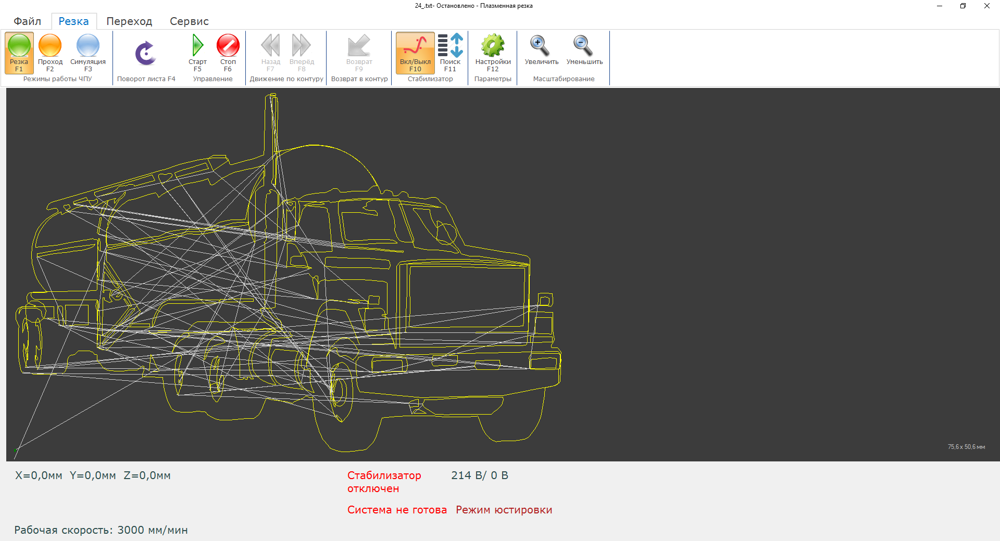

Импорт чертежей в формате DXF
================================

ЧПУ Plasmatic Precision Layout работает с управляющими программами на языках G-code и ESSI. 
Для простых деталей в ПО есть встроенный интерактивный редактор, позволяющий программировать требуемый контур.

Для более сложных деталей требуется CAM-система, которая переводит деталь из чертежных форматов (например, AutoCAD или Компас) в последовательность управляющих кодов.

ЧПУ Plasmatic поддерживает множество CAM-систем, в т.ч. Техтран, PractiCAM, CAMduct, а также бесплатную систему dxf2gcode.

Далее показано, как при помощи программы dxf2gcode импортировать чертеж из формата DXF в G-код.

Последовательность работы с dxf2code
^^^^^^^^^^^^^^^^^^^^^^^^^^^^^^^^^^^^

1.	В программе dxf2gcode в меню “Файл->Открыть” выбрать требуемый DXF-файл. 
В окне утилиты dxf2gcode появится выбранный чертеж, как показано на рисунке 1.

2.	При необходимости, используя пункты меню “Параметры->Scale All” и “Параметры->Move Workpiece to Zero”, 
изменить масштаб чертежа и нулевую точку. Увеличенный в 10 раз и смещенный чертеж показан на рисунке 2.

3.	В меню dxf2code выбрать пункт “Экспорт->Optimize and Export Shapes” для сохранения чертежа в G-коде.

4.	Загрузить чертеж в программу ЧПУ, результат должен соответствовать рисунку 3. 

Видеоинструкция по преобразованию файлов DXF в G-код доступна на Youtube: https://www.youtube.com/watch?v=CdwV18siNWo&t=64s

.. raw:: html

    <iframe width="560" height="315" src="https://www.youtube.com/embed/CdwV18siNWo?rel=0&amp;showinfo=0" frameborder="0" allow="autoplay; encrypted-media" allowfullscreen></iframe>

Полезные файлы
^^^^^^^^^^^^^^

:download:`Plasmatic.cfg - постпроцессор для dxf2gcode, настроенный для ЧПУ Plasmatic <art/Plasmatic.cfg>`.

:download:`Truck.dxf - чертеж из примера <art/truck.dxf>`.

:download:`Truck.txt - чертеж в G-коде <art/truck.txt>`.

