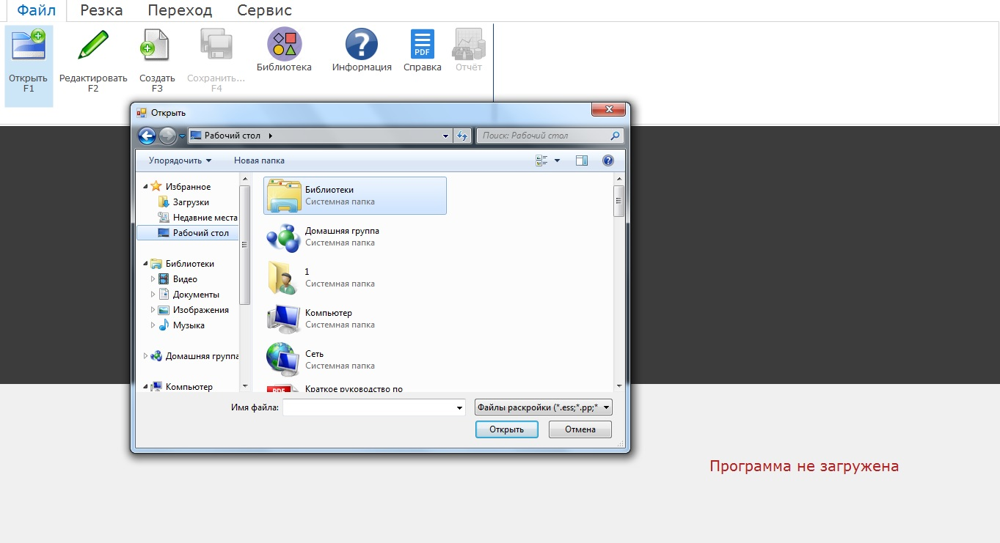
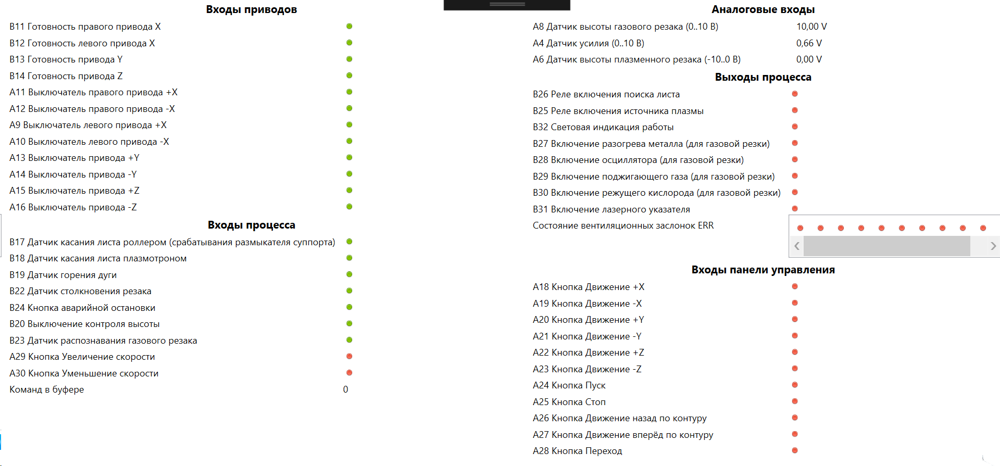

Руководство оператора ЧПУ
================================

Начало работы
--------------

Удостоверьтесь, что к станку подключен кабель заземления, а к столу подключен рабочий кабель источника. 
Включите вводной рубильник на шкафу автоматики.  
Убедитесь, что питание подано, а кабель Ethernet подключен в соответствующий порт компьютера, после чего включите ПК. После того, как ПК полностью загрузится, запустите программу Plasmatic Precision 
Layout двойным кликом по иконке на рабочем столе.
Для стабильной работы ЧПУ не рекомендуется запускать посторонние программы во время работы с интерфейсом ЧПУ. 
До тех пор, пока не загружена ни одна программа, настройки движения станка соответствуют настройкам по умолчанию. 

Юстировка
^^^^^^^^^^^^^^^

Перед тем, как приступать к резке, необходимо выполнить **юстировку**. Юстировка выполняется в автоматическом режиме нажатием на кнопку ``дом``. В процессе юстировки машина определяет положение точки-начала координат, а также компенсирует возможную накопленную разницу между осями X, если для каждой оси используется отдельный привод. При юстировке машина движется по осям с небольшой скоростью, до момента «наезда» на концевые выключатели. После наезда машина немного сдвигается назад. Параметры юстировки настраиваются в соответствующем разделе системных настроек.

Панель управления ЧПУ
----------------------

Экран интерфейса поделен на три части: блок управления ЧПУ, окно визуализации и информационный блок. 

Вкладка «Файл»
^^^^^^^^^^^^^^^

Вкладка **Файл** позволяет загружать и редактировать программу, находящуюся на съемном носителе или на жестком диске ПК.

Кнопка **Открыть** открывает проводник Windows для выбора управляющей программы. ЧПУ позволяет загружать программы в формате .cnc , .txt и .ess.

Кнопка **Редактировать** открывает проводник для выбора
программы, которую необходимо отредактировать. Присутствует окно
визуализации и масштабирование, изменения отображаются в реальном
времени. Так же можно сохранить программу, как с заменой оригинального
файла программы, так и без замены.

.. image:: art/code_editor.jpg
   :alt: Редактировать
   :align: center

Кнопка **Создать** позволяет создать программу в соответствии с
инструкцией по программированию, окно визуализации присутствует.

Кнопка **Библиотека** позволяет создать программу на основе стандартных форм из библиотеки. См. раздел `Библиотека форм (шаблонов)`_.

Кнопка **Сохранить** сохраняет действующую в данный момент
программу.

Кнопка **Отчёт** позволяет сохранить аудит-отчёт с полным протоколом событий и действий оператора. См. раздел `Аудит и отчётность`_.

Вкладка «Резка»
^^^^^^^^^^^^^^^^^^

.. image:: art/cut_tab.jpg
   :alt: Вкладка «Резка»
   :align: center

Во вкладке «Резка» осуществляется выбор режима обработки программы, управление программой и основные настройки.

**Режимы работы ЧПУ:**

Кнопка **Резка** - полноценный режим работы по программе с включением дуги.

Кнопка **Проход** - выполняется только проход по контуру. Дуга не зажигается, датчик касания листа неактивен. Используется для корректного позиционирования резака над заготовкой.

Кнопка **Поворот листа** служит для позиционирования раскроя относительно листа, если лист лежит на столе не симметрично. 

**Управление:**

Кнопка **Старт** - запускает цикл обхода программы в зависимости от выбранного режима работы.

Кнопка **Стоп** - однократное нажатие работает как пауза, то есть останавливает выполнение программы, после чего можно нажать на кнопку «старт», продолжив ее выполнение. Двукратное нажатие кнопки «Стоп» полностью завершает выполнение программы со сбросом положения резака на контуре.

**Движение по контуру:**

Кнопки **Вперед** и **Назад** позволяют передвинуть резак вперед и назад по контуру если выполнение программы остановлено.

**Возврат в контур:**

Кнопка **Возврат** дает возможность вернуться в точку на контуре, где была остановлена программа, если после остановки было произведено смещение с контура.

**Настройки:**

Кнопка **Стабилизатор** включает и выключает стабилизатор высоты резака.

Кнопка **Поиск листа** активирует систему поиска листа. Резак начинает движение до заготовки, по достижении которого поднимается на высоту холостого хода.

Кнопка **Параметры** открывает окно настроек станка. Подробное описание настроек смотреть в главе `Настройки ЧПУ`_

**Масштабирование:**

Кнопки **Увеличить** и **Уменьшить** изменяют размер отображаемой программы относительно окна визуализации.

Вкладка «Переход»
^^^^^^^^^^^^^^^^^^

.. image:: art/move_tab.jpg
   :alt: Вкладка «Переход»
   :align: center

Вкладка «Переход» используется для навигации по деталям или кадрам.

**Выбор кадров:**

Кнопки **Назад** и **Вперед** перемещают точку потенциальной позиции резака на один кадр назад или вперед

**Выбор детали:**

Кнопки **Назад** и **Вперед** позволяют пропустить одну или несколько деталей и перейти к резке нужной детали.

**Программа:**

Кнопки **Начало** и **Конец** позволяют перейти в начало или конец программы.

**Перемещение:**

Кнопка **Дом** активирует режим выхода в ноль станка.

Кнопка **Переход** подает резак в точку, указанную при перемещении по контуру или при пропуске кадров.

**Пропуск кадров:**

Кнопка **Начать** запускает режим пропуска кадров, который доступен не только после начала обработки программ, но и до начала обработки.

Вкладка «Сервис»
^^^^^^^^^^^^^^^^^^

.. image:: art/service_tab.jpg
   :alt: Вкладка «Сервис»
   :align: center

Кнопка **Состояние контроллера** открывает окно, в котором 
отображаются входы и выходы контроллера, и их активность. См. раздел `Диагностика`_.

Кнопка **Напряжение на дуге** открывает окно с графиком напряжения дуги.

Кнопка **Лазерный указатель** активирует модуль лазерного указателя и смещает 
суппорт так, что лазерный указатель находится в том месте, где находился резак. Лазерный указатель 
облегчает выравнивание раскроя на листе и определение точки начала программы.

Кроме того, на этой вкладке размещены кнопки для ручной настройки газового резака.

Кнопка **Подогрев** включает клапаны для подачи газа прогрева.

.. warning:: 
   Кнопка «Подогрев» ВЫКЛЮЧАЕТСЯ ВРУЧНУЮ!

Кнопка **Зажигание** включает клапан поджигающего газа и осциллятора на время, указанное в настройках 
в графе «Время розжига» на вкладке «Циклограмма газовой резки»

Кнопка **Кислород** активирует клапан подачи режущего кислорода. 

.. warning:: 
   Кнопка «Кислород» ВЫКЛЮЧАЕТСЯ ВРУЧНУЮ!

Кнопка **Отчёт о проблеме** создаёт файл отчёта для отправки поставщику, в случае обнаружения ошибок в системе. 

Окно визуализации
------------------

В окне визуализации мы можем наблюдать расположение программы относительно листа. 
Общий размер программы по двум сторонам указан в правом нижнем углу окна. Траектория резки 
отображается желтыми линиями. Белыми линиями показана траектория передвижения инструмента между 
деталями на холостом ходу. Позиция резака изображена зеленой точкой. 

.. image:: art/drawing_visualization.jpg
   :alt: Окно визуализации
   :align: center

Измерение в окне визуализации
^^^^^^^^^^^^^^^^^^^^^^^^^^^^^^^^^^^^

Если вам нужно узнать размер какого-либо элемента раскроя, вы можете 
воспользоваться встроенной в окно визуализации линейкой. Для измерения подведите курсор начальной 
точке измеряемого объекта, зажмите правую кнопку мыши, а затем передвиньте курсор в конечную точку.

Управление движением станка
------------------------------------

Ручное управление движением станка может осуществляться с клавиатуры ПК или с пульта дистанционного 
управления, с учетом того, что некоторые функциональные клавиши доступны только на клавиатуре ПК.

Клавиатура ПК
^^^^^^^^^^^^^^^^^^^^^^

На клавиатуре ПК доступны следующе клавиши:

Клавиши 1, 2, 3, 4 открывают соответствующие вкладки основного меню. Кнопки во всех меню подписаны значением определенной клавиши, назначенной для активации данного действия.

Клавиши направления – передвижение станка в нужном направлении. Дублируются клавишами направления на цифровой клавиатуре справа. Также клавиши направления **влево** и **вправо** осуществляют переход между кадрами в режиме пропуска кадров.

1.	Клавиша ``Enter`` – старт программы.

2.	Клавиша ``Пробел`` – однократное нажатие – пауза в программе, двукратное – отмена выполнения программы.

3.	Клавиша ``Home (Pause)`` – передвижение вверх по оси Z.

4.	Клавиша ``End (brake)`` – перемещение вниз по оси Z.

5.	Кнопка ``Pg up (Page up)`` – перемещение вверх по оси Z на один шаг.

6.	Кнопка ``Pg dn (Page down)`` - перемещение вниз по оси Z на один шаг.

7.	Клавиша ``÷`` – уменьшение заданного напряжения дуги на 1 В.

8.	Клавиша ``×`` – увеличение заданного напряжения дуги на 1 В.

9.	Клавиша ``-`` – уменьшение рабочей скорости на 1%. 

10.	Клавиша ``+`` – увеличение рабочей скорости на 1%.

Пульт дистанционного управления
^^^^^^^^^^^^^^^^^^^^^^^^^^^^^^^^^^^^^^

На пульте дистанционного управления располагаются только основные клавиши управления станком: клавиши направления передвижения, клавиши опускания и подъема резака, и клавиши ****Старт**** (зеленая) и ****Стоп**** (красная).

Библиотека форм (шаблонов)
-----------------------------
Кнопка **Библиотека** во вкладке Файл открывает окно библиотеки стандартных форм. Окно позволяет выбрать одну из стандартных форм, указать количество по вертикали и горизонтали, ввести параметры шаблона, и сгенерировать готовый раскрой. Впоследствии раскрой можно сохранить целиком, воспользовавшись кнопкой «Сохранить» во вкладке «Файл».

.. image:: art/shape_library.jpg
   :alt: Окно «Библиотека форм»
   :align: center

Кнопка **Предварительный просмотр** генерирует раскрой и отображает его в основном окне ЧПУ (если библиотека форм открыта в полноэкранном режиме, то её необходимо свернуть, чтобы увидеть результат предварительного просмотра).

Каждая форма обладает своими собственными настройками – размерами, длиной или радиусом вреза и выхода из контура, итд. Поправка на ширину реза, скорость и прочие параметры задаются уже после генерации полного раскроя.

Результат генерации раскроя с помощью библиотеки форм показан на рисунке ниже.

Настройки ЧПУ
---------------------

Настройки ЧПУ поделены на 4 раздела:

`Карта резки`_ - настройки основных параметров для раскроя: скорости реза, поправки на ширину реза итд. Эти настройки обычно изменяет резчик. Настройки для определённых условий резки (материал, скорость, поправка) можно сохранить в виде «карты резки» и затем использовать их повторно. Обычно так и делается. Окно Карт резки и Параметров Процесса вызывается кнопкой **Параметры** во вкладке **Резка** основного интерфейса. 

`Параметры процесса`_ - настройки дополнительных параметров для раскроя: скорости ручного режима, ускорения, стабилизатора высоты, замедления на окружностях. Как и карты резки, параметры процесса для определённых условий резки (материал, скорость, поправка) можно сохранить в виде и затем использовать их повторно. Обычно так и делается. Окно Карт резки и Параметров Процесса вызывается кнопкой **Параметры** во вкладке **Резка** основного интерфейса. 

`Системные настройки`_ - более тонкие настройки ЧПУ и параметров станка. Эти настройки устанавливаются поставщиком оборудования. Обычно менять их оператору не требуется. Окно системных настроек вызывается кнопкой **Системные настройки** во вкладке **Сервис** основного интерфейса.

`Настройки вентиляции`_ - настройки управления вентиляционными клапанами (для воздушных столов, где организована отдельная вентиляция стола по сегментам). Эти настройки устанавливаются поставщиком оборудования. Обычно менять их оператору не требуется. Окно настроек вентиляции вызывается кнопкой **Системные настройки** во вкладке **Сервис** основного интерфейса.

.. warning:: 
   Необдуманное изменение параметров может нанести повреждения как станку, так и персоналу.

Карта резки
^^^^^^^^^^^^^^^^^^^^^^^^^^^^^
Окно Карт резки и Параметров процесса вызывается кнопкой **Параметры** во вкладке **Резка** основного интерфейса. 

**Конфигурация карты резки** – Название выбранной конфигурации карты резки.

**Режим резки** – Толщина разрезаемого металла и режущий ток.

**Скорость резки, мм/мин** – Скорость резки для материала данного типа и толщины.

**Не использовать скорость из программы** – Отключение задания скорости движения резака в управляющей программе.

**Ширина реза, мм** – Ширина реза металла, удаляемого при резке. Для обеспечения правильных размеров вырезаемых деталей ЧПУ автоматически сдвигает траекторию перемещения резака на половину ширины разреза.

**Высота зажигания, мм** – Высота, на которой происходит зажигание дуги и перенос ее на металл. Высота зажигания должна быть меньше либо равна высоте прожига.

**Высота прожига, мм** – Высота, на которую резак поднимается во время прожига для предотвращения попадания на него брызг металла. Высота прожига должна быть больше или равна высоте зажигания.

**Высота резки, мм** – На высоте резки осуществляется движение резака по заданному контуру заготовки. Высота резки должна быть меньше или равна высоте прожига.

**Время прогрева, с** – Высота, на которой происходит прогрев (для газовой резки)

**Время прожига, с** – Время, в течение которого резак находится на высоте прожига. Это время зависит от тока дуги, толщины и типа металла. Слишком большое время прожига может приводить к потере дуги.

**Длина спуска на высоту резки, мм** – Длина разрезаемого контура, при движении по которой происходит опускание резака с высоты прожига на высоту резки. Данная опция используется за исключения попадания брызг металла на резак при пробивке листов большой толщины. Установите значение параметра равным нулю, если требуется спуск на месте.

**Задать напряжение для стабилизатора высоты вручную** – Отключение автоматического определения напряжение стабилизации после вреза

**Напряжение дуги для стабилизатора высоты, В** – Задаваемое вручную напряжение дуги, которое используется для стабилизации высоты движения резака по оси Z.

**Напряжение датчика высоты на высоте резки, В** – Задаваемое вручную напряжение датчика высоты на высоте резки, которое используется для стабилизации высоты движения резака по оси Z (для газовой резки)

Параметры процесса
^^^^^^^^^^^^^^^^^^^^^^^^^^^^^^^^^^^^^^^
Окно Карт резки и Параметров процесса вызывается кнопкой **Параметры** во вкладке **Резка** основного интерфейса. 

**Конфигурация параметров процесса** – Название выбранной конфигурации параметров процесса.

**Выбранная конфигурация** – Параметры выбранной конфигурации параметров процесса.

**Высота перехода, мм** – Высота, на которую поднимается резак при переходе между резами. 

**Скорость перехода, мм/мин** – Скорость движения резака между резами на высоте перехода. 

**Скорость движения в ручном режиме, мм/мин** – Скорость движения резака в ручном режиме при управлении от клавиатуры или панели управления.

**Ускорение, мм/с/с** – Ускорение задает динамику разгона резака. Для сохранения ресурса механических узлов машины рекомендуется ограничивать величину ускорения.

**Задержка выключения резака, с** – Время, в течение которого резак продолжает работать при достижении конечной точки вырезаемого контура. Параметр используется для компенсации запаздывания движения дуги относительно положения резака.

**Коэффициент усиления THC** – Коэффициент усиления определяет динамику работы стабилизатора высоты резака. При увеличении коэффициента растет скорость движения резака по оси Z при отработке неровностей металла в процессе резки. При слишком большом значении параметра могут появиться автоколебания.

**Задержка авторегулирования высоты, с** – Время после начала резки, в течение которого стабилизатор высоты резака неактивен. Необходимыми условиями включения стабилизатора высоты являются истечение времени задержки включения и разгон резака до скорости резки.

**Коэффициент замедления на окружностях, %** – Параметр задает процент от рабочей скорости, с которой происходит резка окружностей малых диаметров. Коэффициент выбирается из условия исключения конусности малых отверстий из-за запаздывания движения дуги относительно положения резака.

**Замедление на окружностях диаметром менее, мм** – На окружностях и дугах диаметром меньше заданного движение резака будет происходить с замедлением, указанным выше.

Системные настройки
^^^^^^^^^^^^^^^^^^^^^^^^^^^^^^^^^^^^

Окно системных настроек вызывается кнопкой **Системные настройки** во вкладке **Сервис** основного интерфейса.

Параметры станка
"""""""""""""""""""""""""

**Смещение роллера, мм** – Смещение высоты срабатывания размыкателя каретки крепления резака (роллера) относительно точки касания резаком металла.

**Пороговое напряжения датчика усилия привода оси Z, В** – Напряжение датчика усилия, при котором система фиксирует касание резаком металла.

**Малая скорость движения, мм/мин** – Начальная скорость движения машины, с которой происходит разгон. Данная скорость должна быть наименьшей из всех.

**Минимальная скорость движения резака по оси Z, мм/с** – Скорость движения резака по оси Z в процессе поиска листа непосредственно перед касанием металла.

**Максимальная скорость движения резака по оси Z, мм/с** – Скорость движения резака по оси Z в процессе поиска листа при движении вниз с высоты перехода.

**Смещение лазерного указателя по оси X, мм** – Расстояние по оси Х, на которое необходимо сместиться суппорту, чтобы лазерный указатель оказался на месте резака. Параметр определяется конструкцией суппорта.

**Смещение лазерного указателя по оси Y, мм** – Расстояние по оси Y, на которое необходимо сместиться суппорту, чтобы лазерный указатель оказался на месте резака. Параметр определяется конструкцией суппорта.

Юстировка
"""""""""""""""""""""""""

**Скорость при юстировке, мм/мин** – Скорость движения машины в начало координат при юстировке.

**Максимальный перекос по оси Х, мм** – Предельное расстояние по оси Х, на которое может сместиться привод одной из осей Х, если второй привод X уже достиг своего концевого выключателя. Значение перекоса должно исключать возможность повреждения машины при нештатных ситуациях.

**Смещение правой оси Х при достижении концевого выключателя, мм** – Параметр используется для компенсации погрешности установки концевых выключателей.

**Смещениe левой оси Х при достижении концевого выключателя, мм** – 

Газовая резка
"""""""""""""""""""""""""

**Высота калибровки датчика высоты газового резака, мм** – Высота, для которой точно известно выходное напряжение датчика высоты газового резака. По этому параметру для компенсации нелинейности датчика высоты производится автоматическая калибровка положения резака по оси Z.

**Напряжение на высоте калибровки датчика высоты газового резака, В** – Напряжение датчика высоты газового резака на высоте калибровки. По этому параметру для компенсации нелинейности датчика высоты производится автоматическая калибровка положения резака по оси Z.

**Время работы осциллятора, с** – Время работы высоковольтного осциллятора для зажигания факела.

**Коэффициент K в формуле расчёта напряжения датчика высоты H = K*X + B, X = данные с АЦП** – Коэффициент K в формуле расчёта напряжения датчика высоты H = K*X + B, X = данные с АЦП

**Коэффициент B в формуле расчёта напряжения датчика высоты H = K*X + B, X = данные с АЦП** – Коэффициент B в формуле расчёта напряжения датчика высоты H = K*X + B, X = данные с АЦП

**Минимальное рабочее напряжение датчика высоты, В** – Минимальное напряжение емкостного датчика высоты резака, при котором разрешается работа стабилизатора.

**Максимальное рабочее напряжение датчика высоты, В** – Максимальное напряжение емкостного датчика высоты резака, при котором разрешается работа стабилизатора.

**Зона нечувствительности стабилизатора высоты, В** – Максимальная разница между заданным напряжением емкостного датчика высоты резака и его фактическим значением, которая игнорируется алгоритмом стабилизации высоты резака по оси Z.

Плазменная резка
"""""""""""""""""""""""""

**Время блокировки аварии при потере дуги, с** – При завершении реза, связанном с выходом резака за пределы разрезаемого листа металла, может возникать потеря дуги. Если при потере дуги в течение данного времени система ЧПУ выдает источнику тока команду на выключение, авария по потере дуги не формируется.

**Время блокировки аварии при зажигании, с** – Источникам тока как правило требуется некоторое время на зажигание и формирование сигнала переноса (разрешения движения). В течение данного времени блокировки система ЧПУ будет игнорировать отсутствие сигнала переноса.

**Коэффициент делителя напряжения** – Коэффициент внешнего делителя напряжения, преобразующего напряжение плазменной дуги к напряжению от 0 до -10 В на входе контроллера. Типовые значения 25 или 40.

**Коэффициент B в формуле расчёта напряжения дуги V = K*X + B, X = данные с АЦП** – Коэффициент B в формуле расчёта напряжения дуги V = K*X + B, X = данные с АЦП

**Минимальное рабочее напряжение дуги, В** – Минимальное напряжение дуги, при котором разрешается работа стабилизатора высоты резака.

**Максимальное рабочее напряжение дуги, В** – Максимальное напряжение дуги, при котором разрешается работа стабилизатора высоты резака.

**Зона нечувствительности стабилизатора высоты, В** – Максимальная разница между заданным напряжением емкостного датчика высоты резака и его фактическим значением, которая игнорируется алгоритмом стабилизации высоты резака по оси Z.

Настройки вентиляции
^^^^^^^^^^^^^^^^^^^^^^^^^^^^^^^^^^^^^^
Окно настроек вентиляции вызывается кнопкой **Системные настройки** во вкладке **Сервис** основного интерфейса.

.. warning:: 
   Управление заслонками активируется только после проведения юстировки

Дополнительные пояснения к некоторым настройкам
^^^^^^^^^^^^^^^^^^^^^^^^^^^^^^^^^^^^^^^^^^^^^^^^^^

**Малая скорость движения** — скорость, до которой замедляется машина при обходе углов.

**Не использовать скорость, заданную в УП** – включение этой опции позволяет использовать величину рабочей скорости, установленную в ЧПУ, а не в управляющей программе.

**Рабочая скорость движения** - скорость, на которой выполняется программа, скорость резки. Можно корректировать ("+" и "-") непосредственно во время резки.

**Поправка на ширину реза** — параметр, необходимый для правильного размещения деталей в раскрое и сохранения необходимого их размера. Задается или в ЧПУ, или в САПР, в соответствии с руководством к источнику. В ЧПУ вносится половина от табличного значения.

**Задать напряжение для стабилизатора высоты вручную** — если  пункт активирован — появляется возможность установить напряжение для отслеживания стабилизатором высоты; не активирован — система автоматически отслеживает напряжение и в течение некоторого времени устанавливает заданное напряжение самостоятельно для поддержания необходимой высоты. Можно корректировать (**×** и **÷**) непосредственно во время резки.

Параметры **Время прожига**, **Высота прожига** и **Высота резки** задаются в соответствии с руководством для источника плазмы, с помощью которого производится резка или исходя из опыта оператора

**Поворот листа** — аналог кнопки на панели управления, с той разницей, что корректировка вводится напрямую в градусах.

**Скорость движения в ручном режиме** – скорость, с которой движется инструмент, если мы управляем им с клавиатуры ПК или ПДУ.

**Скорость в режиме холостого хода** – скорость, с которой инструмент передвигается между прожигами в процессе выполнения программы.

**Ускорение** — величина ускорения с нуля до необходимой скорости.

**Задержка аварии дуги после обрыва** – время, за которое станок реагирует на гашение дуги в процессе выполнения программы

**Задержка аварии дуги после включения** – время, за которое станок реагирует на отсутствие дуги, если дана команда на зажигание.

**Замедление на окружностях диаметром менее** - величина, после которой замедление включаться не будет (напр. величина равна 30, при диаметре отверстия равном 31мм замедление работать уже не будет).

**Коэффициент замедления на окружностях** – процент скорости, до которого снижается скорость при обходе малых диаметров.

**Задержка гашения дуги** — время, за которое дуга погаснет после окончания обхода контура.

Циклограмма плазменной резки
^^^^^^^^^^^^^^^^^^^^^^^^^^^^^^^^^^^^^^^^^^^^^^^^^

.. image:: art/settings_plasma.jpg
   :alt: Вкладка «Циклограмма плазменной резки»
   :align: center

Во всех режимах система регулировки высоты резака выполняет определение исходной высоты, опускаясь сначала на высокой скорости на расстояние быстрого спуска (h1), а затем на малой скорости на расстояние медленного спуска до тех пор, пока не достигнет предельного значения (h2) или заготовки. После чего возвращается на величину **Высота зажигания** (h3).
После зажигания резака плазменная дуга переносится на заготовку, затем резак перемещается на высоту **Высота прожига** (h4) на время, указанное параметром **Время прожига** (t1). При выполнении последовательности этих действий перед резкой система регулировки высоты резака отключена и ЧПУ не отслеживает дуговое напряжение. По истечении времени **Время прожига** (t1) резак начинает опускаться на **Высоту резки** (h5). После того, как истечет время между включением дуги и включением стабилизатора высоты (вкладка **Стабилизатор высоты**) и скорость резки станет равной скорости, установленной в программе резки, ЧПУ начнет отслеживать дуговое напряжение. По окончании резки инструмент поднимается на **высоту холостого хода** (h6).

Сумма ``h1`` и ``h2`` должна превышать величину h6 на 20 мм, чтобы избежать остановок во время поиска поверхности, если лист имеет неровности. Высота зажигания должна быть немного меньше высоты прожига.

**Порог напряжения датчика усилия** — напряжение, при котором срабатывает датчик момента на валу двигателя.

**Смещение роллера** — величина, на которую поднимается лифт при срабатывании роллера.

**Задержка выключения** — время выключения дуги после прохода контура.

Циклограмма газовой резки
^^^^^^^^^^^^^^^^^^^^^^^^^^^^^^^^^^^^^^^^

.. image:: art/settings_gas.jpg
   :alt: Вкладка «Циклограмма газовой резки»
   :align: center

Последовательность работы газовой системы можно проследить на циклограмме по аналогии с циклограммой плазменной резки.

В отличие от режима плазменной резки, в режиме газовой резки присутствуют такие величины, как:

**Время прогрева** — время, за которое прогревается металл перед последующей пробивкой.

**Высота прогрева** — высота, на которой осуществляется прогрев металла.

В режиме газовой резки поиск листа осуществляется при помощи емкостного датчика. Для калибровки положения газового резака над металлом нужно установить необходимую высоту в графу **Высота калибровки датчика высоты** и определить соответствующее ей напряжение, после чего записать это напряжение в графу **Напряжение на высоте калибровки**. Подбор напряжения осуществляется путем опускания резака с датчиком необходимую высоту над металлом, и последующего наблюдения за аналоговым входом газового датчика в ЧПУ. Величины, такие как **высота прогрева**, **высота резки** и подобные, зависимы от значения **Высота калибровки датчика высоты**.

Стабилизатор высоты
------------------------

Стабилизатор высоты – это система, которая отслеживает действительное напряжение дуги, сравнивает его с заданным напряжением и, путем поднятия и опускания резака, приближает эти значения. Это нужно для того, чтобы в случае искривления листа резак не повредился или не сдвинул лист со стола, для достижения наиболее качественного разреза, а также для уменьшения образования окалины и шлака. Напряжение можно изменять клавишами **×** и **÷**.

* Если действительное значение дугового напряжение больше заданного значения дугового напряжения, то резак перемещается вниз.
* Если действительное значение дугового напряжение меньше заданного значения дугового напряжения, то резак перемещается вверх.
* Чем больше заданное значение дугового напряжения, тем больше высота резки.
  
В данном ЧПУ стабилизатор высоты может работать в двух режимах: задание напряжения вручную и автоматическое определение напряжения.

Основные настройки стабилизатора
^^^^^^^^^^^^^^^^^^^^^^^^^^^^^^^^^

**Напряжение на дуге для стабилизатора высоты** – заданное напряжение для сравнения с действительным напряжением на дуге во время резки.

**Стабилизируемое значение ёмкостного датчика высоты** – напряжение, которое будет поддерживать стабилизатор высоты при работе газового резака. Не зависит от напряжения калибровки датчика.

**Задержка между стартом резки и включением стабилизации высоты** — величина должна быть больше параметра **время прожига**. При прожиге напряжение на дуге может быть нестабильно и для предотвращения нежелательных движений резака величина задержки включения стабилизации задается так, чтобы стабилизация включилась в момент, когда станок вышел на рабочую скорость резки.

Задание напряжения для стабилизатора высоты вручную
^^^^^^^^^^^^^^^^^^^^^^^^^^^^^^^^^^^^^^^^^^^^^^^^^^^^^^^^^^

При включении опции **Задать напряжение для стабилизатора высоты вручную** после включения стабилизатора система работает в обычном режиме, сравнивая действительное и заданное напряжения и корректируя положение резака. Этот режим подходит, если у вас уже есть необходимое значение заданного напряжения для данной толщины материала и данного режима резки.  

Автоматическое определение напряжения для стабилизатора высоты
^^^^^^^^^^^^^^^^^^^^^^^^^^^^^^^^^^^^^^^^^^^^^^^^^^^^^^^^^^^^^^^^^^^

Если опция **Задать напряжение для стабилизатора высоты вручную** отключена, то в начале резки ЧПУ несколько раз измеряет значение дугового напряжения и усредняет полученные значения. Затем для параметра **Напряжение на дуге для стабилизатора высоты** вместо значения, указанного на экране **Стабилизатор высоты**, используется среднее измеренное значение напряжения. Этот режим используется, если неизвестно, какую величину напряжения нужно выставить для поддержания нужной высоты резки. Полученную величину можно откорректировать, записать и использовать как опорное значение при последующей резке в таких же условиях в режиме задания напряжения.

Система выравнивания листа
---------------------------------

Система выравнивания листа позволяет размещать раскрой на листе металла, если лист лежит на столе неровно. После того, как лист положен на стол, нужно подвести инструмент к тому углу листа, где начинается программа, и нажать на клавишу **Поворот листа**, которая находится на вкладке **Резка**. Далее необходимо переместить инструмент к следующему углу на той же стороне листа и повторно нажать на кнопку **Поворот листа**. ЧПУ самостоятельно рассчитывает положение листа и делает корректировку, после чего в окне визуализации отображается угол поворота листа, а изображение программы наклоняется. 
Теперь можно подвести инструмент к углу листа, в котором была отмечена первая опорная точка выравнивания, и начать выполнение программы. Начинать выравнивание желательно с того угла, откуда начинается выполнение программы. Оптимальная схема выравнивания листа определяется по ходу эксплуатации станка.

Информационный блок
-----------------------

Информационный блок находится в нижней части экрана. В нем отображаются координаты положения инструмента, скорость движения инструмента, состояние стабилизатора высоты и состояние системы. Изменения скорости движения инструмента и заданного напряжения дуги отображаются в реальном времени.

Аудит и отчётность
-----------------------------
ЧПУ Plasmatic ведет протокол работы – открытых чертежей, ошибок, зажиганий дуги, аварий и так далее. Для того, чтобы включить аудит, необходимо:
- Установить бесплатную СУБД Microsoft SQL Server LocalDB
- В файле настроек программы установить параметр **EnableAudit** в **true**

Для того, чтобы сгенерировать отчёт, нужно нажать кнопку **Отчёт** во вкладке **Файл** основного окна программы. Затем система предложит выбрать, куда сохранить отчёт. Отчёт имеет следующий вид (пример)::

   *06.04.2018
   Пользователь: user1
   Программа запущена (минут): 245
   Количество запусков программы: 11
   Попыток вреза: 56
   Успешных попыток вреза: 54
   Переходов в ручной режим: 5019
   Количество сообщений об ошибке: 7
   Раскрои: G-к с шр.txt, 200х200 без шр.txt, hypertherm3.ess, 
   Ошибки: 
   Была нажата кнопка аварийной остановки.
   Авария резака. Программа в режиме паузы.
   Ошибка системы поиска листа. Программа в режиме паузы.
   Ошибка привода: X1. Программа в режиме паузы.
   Сработал концевой выключатель: X1+. Программа в режиме паузы.
   Была нажата кнопка аварийной остановки.
   Ошибка системы поиска листа. Программа в режиме паузы.
   Ошибка привода: X1. Программа в режиме паузы.
   Авария резака. Программа в режиме паузы.
   
   
   *07.04.2018
   Пользователь: user1
   Программа запущена (минут): 19
   Количество запусков программы: 13
   Попыток вреза: 6
   Успешных попыток вреза: 6
   Переходов в ручной режим: 31
   Количество сообщений об ошибке: 0
   Раскрои: рр.ess, 50х50 без шр.txt
   Ошибки:

Диагностика
--------------
Система ЧПУ предлагает большие возможности для диагностики и устранения возможных проблем. Эти возможности включают в себя

- `Окно состояния входов и выходов контроллера`_
- Лог-файлы. 
- Отладочные файлы. Эти файлы по умолчанию не создаются, но могут быть включены для детальной диагностики. 

Эти возможности рассмотрены в следующих подразделах.

Окно состояния входов и выходов контроллера
^^^^^^^^^^^^^^^^^^^^^^^^^^^^^^^^^^^^^^^^^^^^^^^^^^^^^

Окно состояния входов и выходов контроллера отображает все входы и выходы контроллера в реальном времени – как цифровые, так и аналоговые входы АЦП. Это даёт возможность понять причину проблемы, если таковая возникнет – например, если будет приходить ложный сигнал от концевых выключателей, итп. Окно состояния входов и выходов контроллера – незаменимый помощник на этапе пуско-наладочных работ.

Пример работы с ЧПУ
------------------------

После загрузки программы ЧПУ Plasmatic мы видим интерфейс ЧПУ.
Переходим во вкладку **Файл** и загружаем нужную программу с помощью кнопки **Открыть**. Можно загрузить программу как со съемного носителя, так и с жесткого диска ПК. Также можно создать программу вручную с помощью кнопки **Создать**. После загрузки программы откроется окно настроек.
Вписываем нужные значения во вкладке **Основные настройки**. Нажимаем ОК.
Выбираем режим работы на экране **Резка** (резка, проход, симуляция).
Если необходимо, включаем стабилизатор высоты. Его можно включить или выключить и в процессе резки.
Нажимаем кнопку **Поиск листа** если не уверены в срабатывании датчика листа, вследствие неисправного заземления или загрязнения листа металла.
Нажимаем кнопку **Старт** для запуска программы.

Пропуск кадров и переход по контуру
^^^^^^^^^^^^^^^^^^^^^^^^^^^^^^^^^^^^^^^^

При необходимости можно зайти на вкладку **Переход** и включить режим пропуска кадров кнопкой **Начать**. Переходим к нужному кадру или детали, следя за точкой, которая отображает позицию резака, и нажимаем кнопку **Переход**, после чего резак автоматически переместится в нужное положение. После этого можно перейти на вкладку **Резка** и начать обработку программы с указанного места. После нажатия кнопки **Дом** резак переместится в начальное положение, если это необходимо.

Переход по контуру доступен, когда программа находится в режиме паузы, если была однократно нажата кнопка **Стоп**. Если программа находится в режиме паузы вследствие ошибки или аварии, то прежде чем продолжить ее выполнение или перемещение по контуру, нужно устранить неисправность и деактивировать сервисный режим. 

